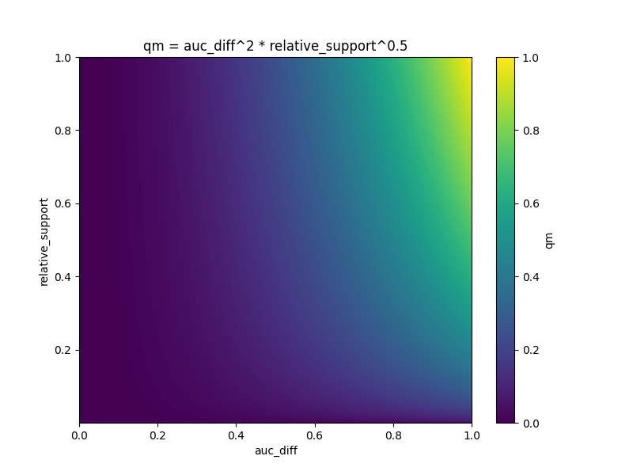

# Reunião 11/11

## Nova medida de qualidade

`(1/(1-auc_diff))^sup_rel` -> `100 * auc_diff^2 * sup_rel^0.5`

- Mais simples e com um comportamento similar.
- Mudanças pequenas no AUC diff afetam fortemente a Qm
- O AUC ao quadrado enfatiza diffs altos e "suprimi" as pequenas (0.1 -> 0.01, 0.5 -> 0.25)
- Tradeoff:
  1. Subgrupos pequenos necessitam de um auc diff alto para competir
  2. Subgrupos grandes com auc diffs moderados podem ser ainda bem ranqueados
- Valores dos expoentes:
  1. Aumentar (supporte): favorizar subgrupos maiores
  2. Diminuir (AUC diff): sentividade reduzida para diffs pequenos



 da medida de qualidade")

## Possíveis testes synth

- Número de iterações:
    - 1k, 2k, 5k, 10k, 20k, 50k
    - Até achar cada padrão (ver se é estável)
    - Até achar todos padrões (ver se é estável)
- Dataset tamanhos 1k, 2k, 5k, 10k, 25k, 50k
- Sequências de tamanho 10-20, 20-35, 35-50
- Padrões injetáveis (suporte)
    - Suporte absoluto de 20
    - Suporte relativo de 0.1% (será? artigo do subROC usa entre 0.4% e 0.6%)
    - Suporte relativo de 1%
    - Suporte relativo de 5%
    - Suporte relativo de 10%
    - Suporte relativo de 20%
- Padrões injetáveis (AUC)
    - 0.5, 0.6, 0.7, 0.8, 0.9, (target 0.95), 1
    - 0.5, 0.6, 0.7, (target 0.75), 0.8, 0.9, 1
- Padrões injetáveis (tamanho)
    - 1, 2, 3, 5, 8
- Ruido
    - 0%, 25%, 50%, 75%, 100%
- Variação dos expoentes (?)

## Alguns experimentos

### Dataset 5k instâncias

- Porcentagem dos padrões no dataset: 20 / 5000 = 0.4%

```
Number iteration mcts: 2000 (não acha sempre com 2000)
Model ROC AUC: 0.9505164799999999
Quality: 0.7638556790209183, Extent: 20, ROCAUC: 0.68, Pattern: {'P'}{'Q', 'S'}{'P', 'R'}
Quality: 0.5553204980953805, Extent: 20, ROCAUC: 0.75, Pattern: {'N', 'M'}{'N', 'M'}{'N'}
Quality: 0.541224142364359, Extent: 20, ROCAUC: 0.8, Pattern: {'C'}{'E'}
Quality: 0.5236640269897461, Extent: 4008, ROCAUC: 0.9475549010545943, Pattern: {'T'}
Quality: 0.39962254397986596, Extent: 2365, ROCAUC: 0.9455703354072803, Pattern: {'W'}{'Y'}
Quality: 0.39841978227807984, Extent: 2355, ROCAUC: 0.9478724708767627, Pattern: {'U'}{'Y'}
Quality: 0.39836775292158966, Extent: 2399, ROCAUC: 0.9480314763614527, Pattern: {'Y'}{'Y'}
Quality: 0.39820422178590564, Extent: 2360, ROCAUC: 0.9485554163711094, Pattern: {'W'}{'W'}
Quality: 0.39813834911682167, Extent: 2429, ROCAUC: 0.9488295725206577, Pattern: {'W'}{'X'}
Quality: 0.39796820315832704, Extent: 2373, ROCAUC: 0.9498767449294925, Pattern: {'W'}{'U'}
Average score :0.4774785199710994

Number iteration mcts: 3000
Model ROC AUC: 0.9505164799999999
Quality: 0.9857044286372746, Extent: 20, ROCAUC: 0.68, Pattern: {'P', 'R'}
Quality: 0.7771692477117369, Extent: 20, ROCAUC: 0.75, Pattern: {'N'}
Quality: 0.6661628789726588, Extent: 20, ROCAUC: 0.8, Pattern: {'E'}
Quality: 0.5236640269897461, Extent: 4008, ROCAUC: 0.9475549010545943, Pattern: {'T'}
Quality: 0.39962254397986596, Extent: 2365, ROCAUC: 0.9455703354072803, Pattern: {'W'}{'Y'}
Quality: 0.39841978227807984, Extent: 2355, ROCAUC: 0.9478724708767627, Pattern: {'U'}{'Y'}
Quality: 0.39836775292158966, Extent: 2399, ROCAUC: 0.9480314763614527, Pattern: {'Y'}{'Y'}
Quality: 0.39820422178590564, Extent: 2360, ROCAUC: 0.9485554163711094, Pattern: {'W'}{'W'}
Quality: 0.39813834911682167, Extent: 2429, ROCAUC: 0.9488295725206577, Pattern: {'W'}{'X'}
Quality: 0.39796820315832704, Extent: 2373, ROCAUC: 0.9498767449294925, Pattern: {'W'}{'U'}
Average score :0.5343421435552007
```

### Dataset 10k instâncias

- Porcentagem dos padrões no dataset: 20 / 10000 = 0.2%

```
Number iteration mcts: 3000
Model ROC AUC: 0.9505164799999999
Quality: 0.8607656920289748, Extent: 20, ROCAUC: 0.68, Pattern: {'S', 'Q'}{'R', 'P'}
Quality: 0.6661628789726588, Extent: 20, ROCAUC: 0.8, Pattern: {'E'}
Quality: 0.5553204980953805, Extent: 20, ROCAUC: 0.75, Pattern: {'N'}{'N', 'M'}{'N'}
Quality: 0.5236640269897461, Extent: 4008, ROCAUC: 0.9475549010545943, Pattern: {'T'}
Quality: 0.5036316218843924, Extent: 21, ROCAUC: 0.7000000000000001, Pattern: {'T'}{'W'}{'X'}{'X'}{'X'}{'Y'}
Quality: 0.39962254397986596, Extent: 2365, ROCAUC: 0.9455703354072803, Pattern: {'W'}{'Y'}
Quality: 0.39841978227807984, Extent: 2355, ROCAUC: 0.9478724708767627, Pattern: {'U'}{'Y'}
Quality: 0.39836775292158966, Extent: 2399, ROCAUC: 0.9480314763614527, Pattern: {'Y'}{'Y'}
Quality: 0.39820422178590564, Extent: 2360, ROCAUC: 0.9485554163711094, Pattern: {'W'}{'W'}
Quality: 0.39813834911682167, Extent: 2429, ROCAUC: 0.9488295725206577, Pattern: {'W'}{'X'}

Number iteration mcts: 5000
Model ROC AUC: 0.95109044
Quality: 0.7265973992293893, Extent: 20, ROCAUC: 0.68, Pattern: {'Q'}{'R', 'P'}
Quality: 0.7037201394878954, Extent: 20, ROCAUC: 0.75, Pattern: {'N'}
Quality: 0.6249701006823256, Extent: 20, ROCAUC: 0.8, Pattern: {'E'}
Quality: 0.5233394252650097, Extent: 8039, ROCAUC: 0.9488237132768229, Pattern: {'U'}
Quality: 0.39872719992919925, Extent: 4734, ROCAUC: 0.9477079768990417, Pattern: {'Y'}{'X'}
Quality: 0.3985592740278038, Extent: 4719, ROCAUC: 0.9480879892111477, Pattern: {'X'}{'V'}
Quality: 0.3985459838838895, Extent: 4798, ROCAUC: 0.9481326838320575, Pattern: {'W'}{'X'}
Quality: 0.3984175897612616, Extent: 4774, ROCAUC: 0.9484613651106562, Pattern: {'W'}{'V'}
Quality: 0.3983466405036451, Extent: 4774, ROCAUC: 0.9486644998475715, Pattern: {'Y'}{'V'}
Quality: 0.39829870660357714, Extent: 4838, ROCAUC: 0.9488195402100444, Pattern: {'W'}{'Y'}
```

### Dataset 20k instâncias

- Porcentagem dos padrões no dataset: 20 / 20000 = 0.1%

```
Number iteration mcts: 10000
Model ROC AUC: 0.95299778
Quality: 0.7585563039706141, Extent: 20, ROCAUC: 0.68, Pattern: {'R', 'P'}
Quality: 0.6531901951697006, Extent: 20, ROCAUC: 0.75, Pattern: {'N'}
Quality: 0.47196361823604416, Extent: 20, ROCAUC: 0.8, Pattern: {'C'}{'E'}
Quality: 0.23082162087178004, Extent: 1269, ROCAUC: 0.9341240467969893, Pattern: {'W'}{'T'}{'T'}{'T'}
Quality: 0.22883688555781412, Extent: 1340, ROCAUC: 0.9365668565724713, Pattern: {'X'}{'U'}{'X'}{'Y'}
Quality: 0.22823386262757606, Extent: 1231, ROCAUC: 0.9369550867372535, Pattern: {'Z'}{'X'}{'T'}{'T'}
Quality: 0.2281927654669712, Extent: 1264, ROCAUC: 0.9371122078968575, Pattern: {'W'}{'V'}{'T'}{'T'}
Quality: 0.2279639643600173, Extent: 1291, ROCAUC: 0.9374834939521841, Pattern: {'U'}{'T'}{'T'}{'X'}
Quality: 0.2278235299289344, Extent: 1297, ROCAUC: 0.9376804356614588, Pattern: {'Y'}{'X'}{'U'}{'Z'}
Quality: 0.22769251100998056, Extent: 1352, ROCAUC: 0.9380057803468208, Pattern: {'V'}{'T'}{'X'}{'T'}

Number iteration mcts: 15000
Model ROC AUC: 0.95299778
Quality: 0.7585563039706141, Extent: 20, ROCAUC: 0.68, Pattern: {'P'}
Quality: 0.5282514585614008, Extent: 20, ROCAUC: 0.75, Pattern: {'N', 'M'}{'N'}
Quality: 0.47196361823604416, Extent: 20, ROCAUC: 0.8, Pattern: {'C'}{'E'}
Quality: 0.23082162087178004, Extent: 1269, ROCAUC: 0.9341240467969893, Pattern: {'W'}{'T'}{'T'}{'T'}
Quality: 0.22883688555781412, Extent: 1340, ROCAUC: 0.9365668565724713, Pattern: {'X'}{'U'}{'X'}{'Y'}
Quality: 0.22823386262757606, Extent: 1231, ROCAUC: 0.9369550867372535, Pattern: {'Z'}{'X'}{'T'}{'T'}
Quality: 0.2281927654669712, Extent: 1264, ROCAUC: 0.9371122078968575, Pattern: {'W'}{'V'}{'T'}{'T'}
Quality: 0.2279639643600173, Extent: 1291, ROCAUC: 0.9374834939521841, Pattern: {'U'}{'T'}{'T'}{'X'}
Quality: 0.22769251100998056, Extent: 1352, ROCAUC: 0.9380057803468208, Pattern: {'V'}{'T'}{'X'}{'T'}
Quality: 0.227475340794431, Extent: 1384, ROCAUC: 0.9383727705001221, Pattern: {'W'}{'Y'}{'T'}{'W'}
```

- Porcentagem dos padrões no dataset: 80 / 20000 = 0.4%

```
Number iteration mcts: 1000
Model ROC AUC: 0.95115095
Quality: 0.8607980969747946, Extent: 80, ROCAUC: 0.6806249999999999, Pattern: {'Q'}{'R', 'P'}
Quality: 0.7850485211967948, Extent: 80, ROCAUC: 0.70375, Pattern: {'M', 'N'}{'N'}
Quality: 0.446722066215281, Extent: 80, ROCAUC: 0.799375, Pattern: {'B', 'A'}{'C'}{'E'}
Quality: 0.22567315419814848, Extent: 1329, ROCAUC: 0.9389706448529977, Pattern: {'V'}{'X'}{'T'}{'W'}
Quality: 0.2252573647855609, Extent: 1353, ROCAUC: 0.9397031499333289, Pattern: {'W'}{'W'}{'X'}{'V'}
Quality: 0.2244483844300661, Extent: 1265, ROCAUC: 0.9409839917609062, Pattern: {'U'}{'Y'}{'T'}{'X'}
Quality: 0.16683888510017086, Extent: 301, ROCAUC: 0.9199575934269812, Pattern: {'U'}{'U'}{'V'}{'T'}{'X'}
Quality: 0.16564097369769648, Extent: 325, ROCAUC: 0.9221261753108886, Pattern: {'T'}{'W'}{'T'}{'W'}{'V'}
Quality: 0.164357999971964, Extent: 314, ROCAUC: 0.923679616774246, Pattern: {'W'}{'W'}{'X'}{'T'}{'W'}
Quality: 0.1632972628666859, Extent: 325, ROCAUC: 0.9254881025015254, Pattern: {'V'}{'T'}{'V'}{'X'}{'X'}

Number iteration mcts: 1000
Model ROC AUC: 0.95115095
Quality: 0.9099872578050947, Extent: 80, ROCAUC: 0.70375, Pattern: {'N'}
Quality: 0.6685708158316372, Extent: 80, ROCAUC: 0.799375, Pattern: {'E'}
Quality: 0.3983290728130884, Extent: 40, ROCAUC: 0.7525, Pattern: {'V'}{'A', 'B'}{'C'}{'E'}
Quality: 0.22609017289936884, Extent: 1344, ROCAUC: 0.9383596851956891, Pattern: {'U'}{'U'}{'T'}{'X'}
Quality: 0.2252520060248846, Extent: 1310, ROCAUC: 0.9396194179470602, Pattern: {'V'}{'X'}{'V'}{'V'}
Quality: 0.22450370855469437, Extent: 1319, ROCAUC: 0.9409831919247662, Pattern: {'W'}{'X'}{'V'}{'W'}
Quality: 0.1689529259942847, Extent: 351, ROCAUC: 0.9185834957764782, Pattern: {'W'}{'W'}{'X'}{'X'}{'W'}
Quality: 0.16314204413557665, Extent: 286, ROCAUC: 0.9249007985107529, Pattern: {'X'}{'T'}{'X'}{'Z'}{'Y'}
Quality: 0.16244879799800904, Extent: 339, ROCAUC: 0.9270746310219994, Pattern: {'T'}{'T'}{'W'}{'V'}{'T'}
Quality: 0.16242938526637163, Extent: 308, ROCAUC: 0.9265221616596949, Pattern: {'W'}{'X'}{'Y'}{'W'}{'U'}

Number iteration mcts: 1000
Model ROC AUC: 0.95115095
Quality: 0.8607980969747946, Extent: 80, ROCAUC: 0.6806249999999999, Pattern: {'S', 'Q'}{'P', 'R'}
Quality: 0.22554974401388705, Extent: 1362, ROCAUC: 0.9392420284087959, Pattern: {'T'}{'T'}{'T'}{'X'}
Quality: 0.22554376452596603, Extent: 1345, ROCAUC: 0.9392142294867373, Pattern: {'T'}{'T'}{'V'}{'X'}
Quality: 0.2254456915630354, Extent: 1350, ROCAUC: 0.9393846268666546, Pattern: {'U'}{'T'}{'Z'}{'X'}
Quality: 0.2248762890638789, Extent: 1334, ROCAUC: 0.9403238176203745, Pattern: {'X'}{'X'}{'T'}{'V'}
Quality: 0.22480536508070914, Extent: 1334, ROCAUC: 0.9404513888888888, Pattern: {'T'}{'W'}{'T'}{'T'}
Quality: 0.2247267636596405, Extent: 1314, ROCAUC: 0.9405546288573812, Pattern: {'X'}{'T'}{'U'}{'X'}
Quality: 0.22449132864907861, Extent: 1337, ROCAUC: 0.94104124135955, Pattern: {'T'}{'V'}{'X'}{'Z'}
Quality: 0.1655487478048826, Extent: 312, ROCAUC: 0.9219546276508302, Pattern: {'Y'}{'T'}{'Y'}{'U'}{'X'}
Quality: 0.16304433254008988, Extent: 310, ROCAUC: 0.9255773092369479, Pattern: {'U'}{'X'}{'V'}{'V'}{'X'}
```

```
Number iteration mcts: 5000
Model ROC AUC: 0.95115095
Quality: 0.9857368335830945, Extent: 80, ROCAUC: 0.6806249999999999, Pattern: {'P'}
Quality: 0.9099872578050947, Extent: 80, ROCAUC: 0.70375, Pattern: {'N'}
Quality: 0.6685708158316372, Extent: 80, ROCAUC: 0.799375, Pattern: {'E'}
Quality: 0.2271649618740701, Extent: 1262, ROCAUC: 0.936603267422233, Pattern: {'W'}{'W'}{'T'}{'W'}
Quality: 0.22567315419814848, Extent: 1329, ROCAUC: 0.9389706448529977, Pattern: {'V'}{'X'}{'T'}{'W'}
Quality: 0.22554974401388705, Extent: 1362, ROCAUC: 0.9392420284087959, Pattern: {'T'}{'T'}{'T'}{'X'}
Quality: 0.22554376452596603, Extent: 1345, ROCAUC: 0.9392142294867373, Pattern: {'T'}{'T'}{'V'}{'X'}
Quality: 0.2252573647855609, Extent: 1353, ROCAUC: 0.9397031499333289, Pattern: {'W'}{'W'}{'X'}{'V'}
Quality: 0.22516617927033977, Extent: 1401, ROCAUC: 0.939955312547144, Pattern: {'T'}{'T'}{'W'}{'V'}
Quality: 0.2249350509585889, Extent: 1332, ROCAUC: 0.9402151488026118, Pattern: {'U'}{'X'}{'T'}{'X'}

Number iteration mcts: 5000
Model ROC AUC: 0.95115095
Quality: 0.9857368335830945, Extent: 80, ROCAUC: 0.6806249999999999, Pattern: {'R', 'P'}
Quality: 0.7850485211967948, Extent: 80, ROCAUC: 0.70375, Pattern: {'N'}{'N'}
Quality: 0.6685708158316372, Extent: 80, ROCAUC: 0.799375, Pattern: {'E'}
Quality: 0.42482103868588583, Extent: 37, ROCAUC: 0.7339181286549707, Pattern: {'W'}{'R', 'P'}{'S', 'Q'}{'R', 'P'}
Quality: 0.22842580682498648, Extent: 1340, ROCAUC: 0.935210627302326, Pattern: {'V'}{'X'}{'T'}{'V'}
Quality: 0.22744002969710586, Extent: 1245, ROCAUC: 0.9361809850022991, Pattern: {'V'}{'X'}{'T'}{'Z'}
Quality: 0.22554974401388705, Extent: 1362, ROCAUC: 0.9392420284087959, Pattern: {'T'}{'T'}{'T'}{'X'}
Quality: 0.22554376452596603, Extent: 1345, ROCAUC: 0.9392142294867373, Pattern: {'T'}{'T'}{'V'}{'X'}
Quality: 0.22545906233204083, Extent: 1293, ROCAUC: 0.9392349559364873, Pattern: {'W'}{'W'}{'X'}{'W'}
Quality: 0.2254456915630354, Extent: 1350, ROCAUC: 0.9393846268666546, Pattern: {'U'}{'T'}{'Z'}{'X'}
```

### Dataset 50k instâncias

- Porcentagem dos padrões no dataset: 20 / 50000 = 0.04%
- Demora umas 2-3 horas

```
Number iteration mcts: 10000
Model ROC AUC: 0.9522279312
Quality: 0.5692254313552014, Extent: 20, ROCAUC: 0.8, Pattern: {'E'}
Quality: 0.5461561017229015, Extent: 20, ROCAUC: 0.68, Pattern: {'Q'}{'R', 'P'}
Quality: 0.3828222679788451, Extent: 20, ROCAUC: 0.75, Pattern: {'N', 'M'}{'N', 'M'}{'N'}
Quality: 0.22563989791411987, Extent: 3198, ROCAUC: 0.9399843554443054, Pattern: {'T'}{'U'}{'Z'}{'Y'}
Quality: 0.22442259122763408, Extent: 3257, ROCAUC: 0.9421857287987565, Pattern: {'X'}{'Z'}{'V'}{'Z'}
Quality: 0.16209532497207624, Extent: 852, ROCAUC: 0.9287533068783068, Pattern: {'W'}{'T'}{'W'}{'Z'}{'Y'}
Quality: 0.16174285264580668, Extent: 850, ROCAUC: 0.9293222001207885, Pattern: {'W'}{'T'}{'T'}{'T'}{'Z'}
Quality: 0.16027415091932273, Extent: 844, ROCAUC: 0.9318934728198207, Pattern: {'V'}{'U'}{'U'}{'Z'}{'Y'}
Quality: 0.15993853136162028, Extent: 773, ROCAUC: 0.932101576416699, Pattern: {'T'}{'U'}{'Z'}{'V'}{'Y'}
Quality: 0.15985750284320777, Extent: 803, ROCAUC: 0.9324532617342879, Pattern: {'V'}{'X'}{'Z'}{'V'}{'Z'}
```

## Perguntas

1. Como que a qualidade dos padrões injetados muda a medida que a quantidade de iterações muda
2. Quantidade de vezes que um padrão é encontrado com base no tamanho do dataset e no número de iterações
    1. Para um dataset de tamanho x e um padrão de suporte y, qual é o número minimo de iterações necessárias
3. Qual a qualidade média dos top-10 subgrupos encontrados a medida que aumentamos o número de iterações?